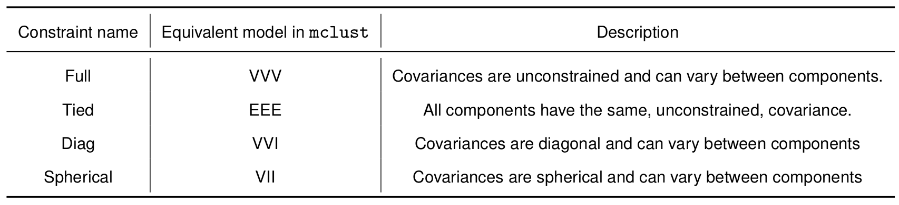
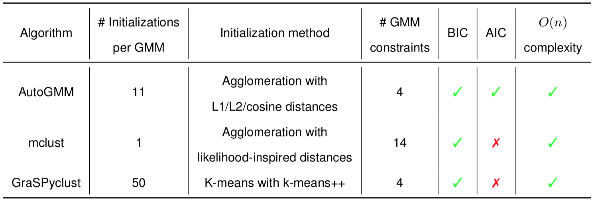
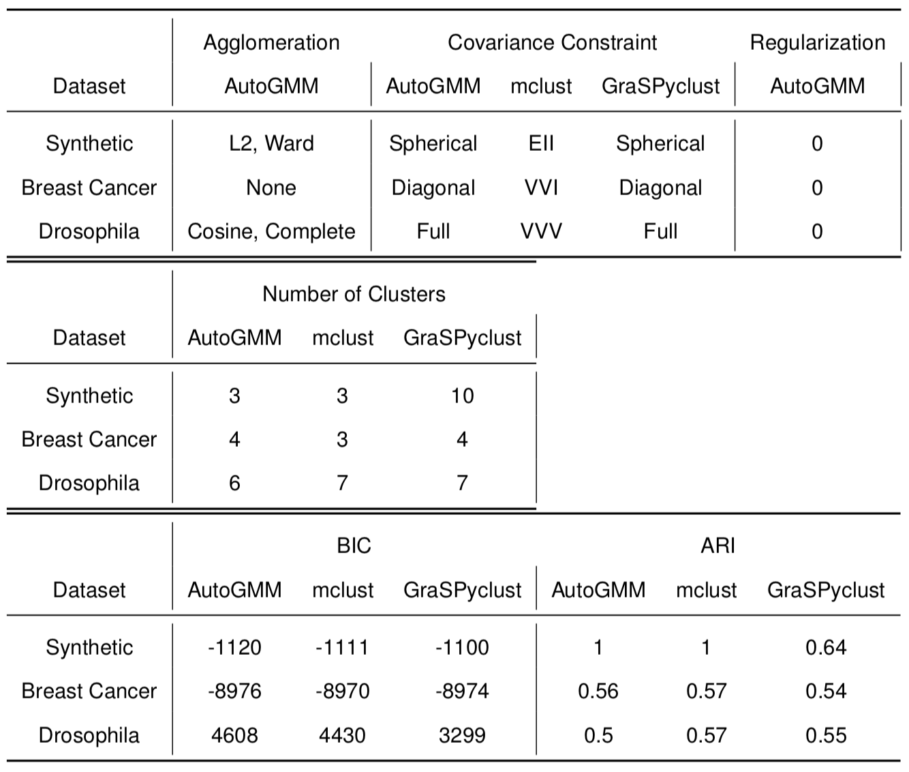
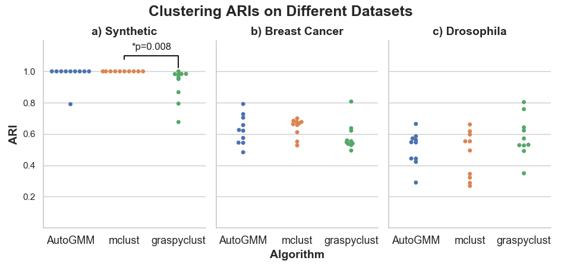
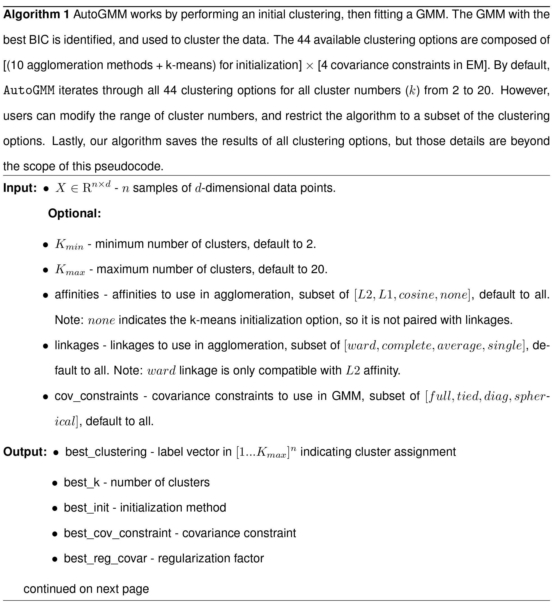
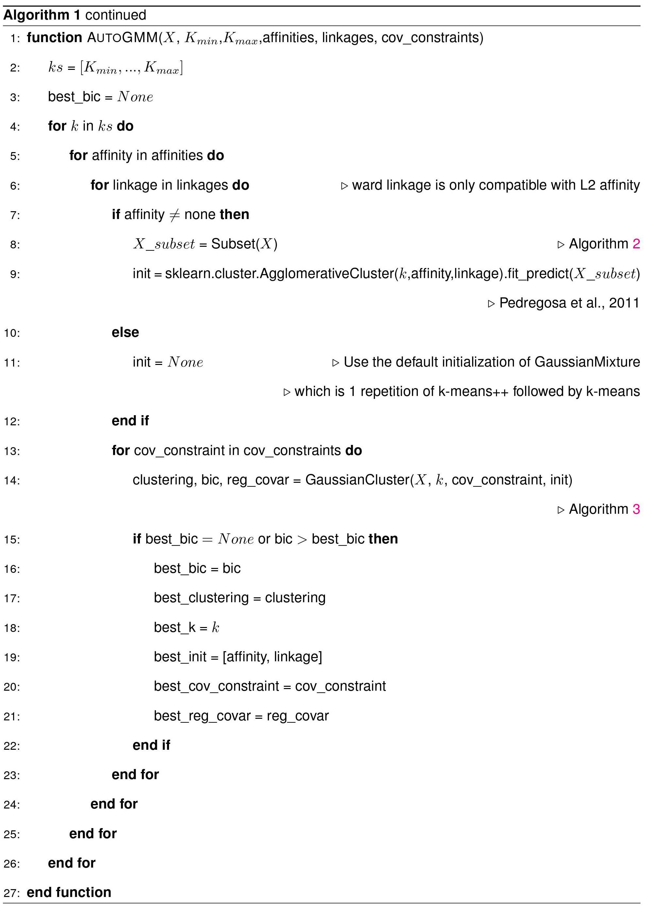
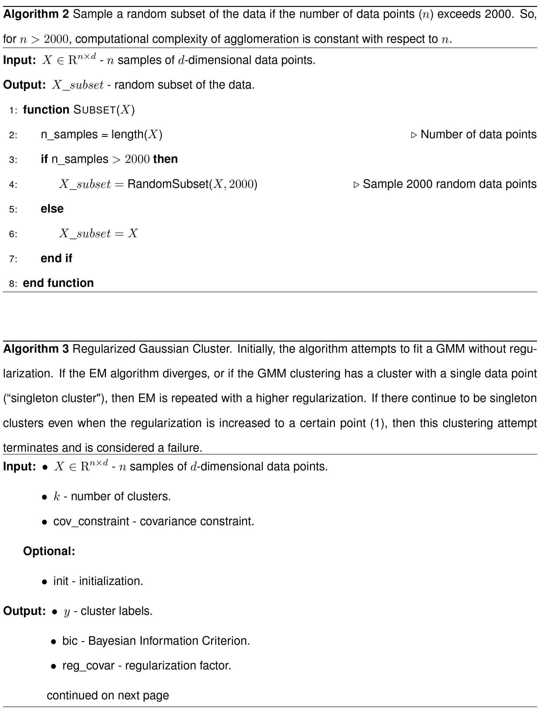
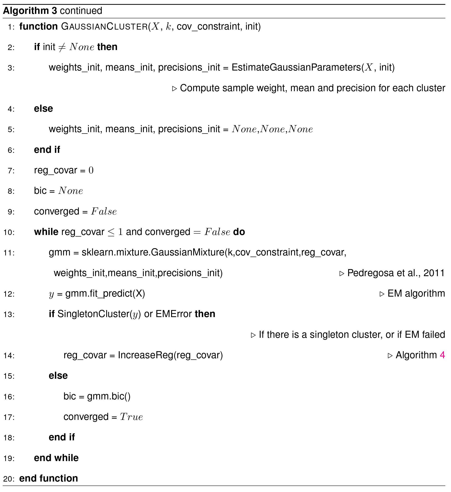
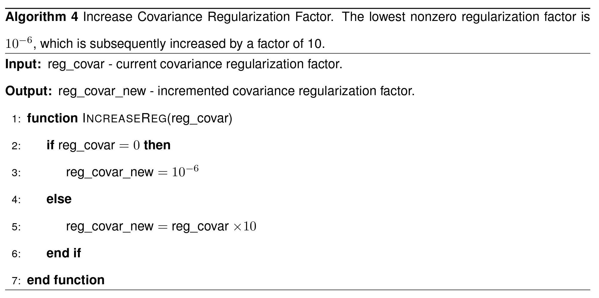

# Summary

Gaussian mixture modeling is a fundamental tool in clustering, as well
as discriminant analysis and semiparametric density estimation. However,
estimating the optimal model for any given number of components is an
NP-hard problem, and estimating the number of components is in some
respects an even harder problem. In R, a popular package called `mclust`
addresses both of these problems. However, Python has lacked such a
package. We therefore introduce `AutoGMM`, a Python algorithm for
automatic Gaussian mixture modeling, and its hierarchical version,
`HGMM`. `AutoGMM` builds upon `scikit-learn`’s `AgglomerativeClustering`
and `GaussianMixture` classes, with certain modifications to make the
results more stable. Empirically, on several different applications,
`AutoGMM` performs approximately as well as `mclust`, and sometimes
better. This package is freely available, and further shrinks the gap
between functionality of R and Python for data science.

Introduction
============

Clustering is a fundamental problem in data analysis where a set of
objects is partitioned into clusters according to similarities between
the objects. Objects within a cluster are similar to each other, and
objects across clusters are different, according to some criteria.
Clustering has its roots in the 1960s [@cluster_og1; @cluster_og2], but
is still researched heavily today [@cluster_review; @jain]. Clustering
can be applied to many different problems such as separating potential
customers into market segments [@cluster_market], segmenting satellite
images to measure land cover [@cluster_satellite], or identifying when
different images contain the same person [@cluster_face].

A popular technique for clustering is Gaussian mixture modeling. In this
approach, a Gaussian mixture is fit to the observed data via maximum
likelihood estimation. The flexibility of the Gaussian mixture model,
however, comes at the cost hyperparameters that can be difficult to
tune, and model assumptions that can be difficult to choose [@jain]. If
users make assumptions about the model’s covariance matrices, they risk
inappropriate model restriction. On the other hand, relaxing covariance
assumptions leads to a large number of parameters to estimate. Users are
also forced to choose the number of mixture components and how to
initialize the estimation procedure.

This paper presents `AutoGMM`, a Gaussian mixture model based algorithm
implemented in python that automatically chooses the initialization,
number of clusters and covariance constraints. Inspired by the `mclust`
package in R [@mclust5], our algorithm iterates through different
clustering options and cluster numbers and evaluates each according to
the Bayesian Information Criterion. The algorithm starts with
agglomerative clustering, then fits a Gaussian mixture model with a
dynamic regularization scheme that discourages singleton clusters. We
compared the algorithm to `mclust` on several datasets, and they perform
similarly.

Background
==========

Gaussian Mixture Models
-----------------------

The most popular statistical model of clustered data is the Gaussian
mixture model (GMM). A Gaussian mixture is simply a composition of
multiple normal distributions. Each component has a “weight”, $w_i$: the
proportion of the overall data that belongs to that component.
Therefore, the combined probability distribution, $f(x)$ is of the form:

$$f(x) = \sum_{k=1}^{K} w_k f_k(x) = \sum_{k=1}^{K} \frac{w_k}{(2\pi)^{\frac{d}{2}}|\Sigma_k|^{-\frac{1}{2}}}\exp \left \{ {\frac{1}{2}(x-\mu_k)^T\Sigma_k^{-1}(x-\mu_k)} \right\}$$

where $k$ is the number of clusters, $d$ is the dimensionality of the
data.

The maximum likelihood estimate (MLE) of Gaussian mixture parameters
cannot be directly computed, so the Expectation-Maximization (EM)
algorithm is typically used to estimate model parameters [@mclachlan].
The EM algorithm is guaranteed to monotonically increase the likelihood
with each iteration [@em]. A drawback of the EM algorithm, however, is
that it can produce singular covariance matrices if not adequately
constrained. The computational complexity of a single EM iteration with
respect to the number of data points is $O(n)$.

After running EM, the fitted GMM can be used to “hard cluster” data by
calculating which mixture component was most likely to produce a data
point. Soft clusterings of the data are also available upon running the
EM algorithm, as each point is assigned a weight corresponding to all
$k$ components.

To initialize the EM algorithm, typically all points are assigned a
cluster, which is then fed as input into the M-step. The key question in
the initialization then becomes how to initially assign points to
clusters.

Initialization
--------------

### Random

The simplest way to initialize the EM algorithm is by randomly choosing
data points to serve as the initial mixture component means. This method
is simple and fast, but different initializations can lead to
drastically different results. In order to alleviate this issue, it is
common to perform random initialization and subsequent EM several times,
and choose the best result. However, there is no guarantee the random
initializations will lead to satisfactory results, and running EM many
times can be computationally costly.

### K-Means

Another strategy is to use the k-means algorithm to initialize the
mixture component means. K-means is perhaps the most popular clustering
algorithm [@jain], and it seeks to minimize the squared distance within
clusters. The k-means algorithm is usually fast, since the computational
complexity of performing a fixed number iterations is $O(n)$
[@cluster_review]. K-means itself needs to be initialized, and k-means++
is a principled choice, since it bounds the k-means cost function
[@kmeans]. Since there is randomness in k-means++, running this
algorithm on the same dataset may result in different clusterings.
`graspologic`, a Python package for graph statistics, performs EM
initialization this way in its `GaussianCluster` class.

### Agglomerative Clustering

Agglomerative clustering is a hierarchical technique that starts with
every data point as its own cluster. Then, the two closest clusters are
merged until the desired number of clusters is reached. In
`scikit-learn`’s `AgglomerativeClustering` class, “closeness” between
clusters can be quantified by L1 distance, L2 distance, or cosine
similarity.

Additionally, there are several linkage criteria that can be used to
determine which clusters should be merged next. Complete linkage, which
merges clusters according to the maximally distant data points within a
pair of clusters, tends to find compact clusters of similar size. On the
other hand, single linkage, which merges clusters according to the
closest pairs of data points, is more likely to result in unbalanced
clusters with more variable shape. Average linkage merges according to
the average distance between points of different clusters, and Ward
linkage merges clusters that cause the smallest increase in
within-cluster variance. All four of these linkage criteria are
implemented in `AgglomerativeClustering` and further comparisons between
them can be found in @everitt.

The computational complexity of agglomerative clustering can be
prohibitive in large datasets [@xu]. Naively, agglomerative clustering
has computational complexity of $O(n^3)$. However, algorithmic
improvements have improved this upper bound @hclust_eff. @scikit-learn
uses minimum spanning tree and nearest neighbor chain methods to achieve
$O(n^2)$ complexity. Efforts to make faster agglomerative methods
involve novel data structures [@birch], and cluster summary statistics
[@cure], which approximate standard agglomeration methods. The algorithm
in @mclust5 caps the number of data points on which it performs
agglomeration by some number $N$. If the number of data points exceeds
$N$, then it agglomerates a random subset of $N$ points, and uses those
results to initialize the M step of the GMM initialization. So as $n$
increases beyond this cap, computational complexity of agglomeration
remains constant with respect to $n$ per iteration.

Covariance Constraints
----------------------

There are many possible constraints that can be made on the covariance
matrices in Gaussian mixture modeling [@constraints; @mclust5].
Constraints lower the number of parameters in the model, which can
reduce overfitting, but can introduce unnecessary bias. `scikit-learn`’s
`GaussianMixture` class implements four covariance constraints (see
Table 1).

**Table 1**: Covariance Constraints in scikit-learn’s GaussianMixture

Automatic Model Selection
-------------------------

When clustering data, the user must decide how many clusters to use. In
Gaussian mixture modeling, this cannot be done with the typical
likelihood ratio test approach because mixture models do not satisfy
regularity conditions [@mclachlan].

One approach to selecting the number of components is to use a Dirichlet
process model [@rasmussen; @ferguson]. The Dirichlet process is an
extension of the Dirichlet distribution which is the conjugate prior to
the multinomial distribution. The Dirichlet process models the
probability that a data point comes from the same mixture component as
other data points, or a new component altogether. This approach requires
approximating posterior probabilities of clusterings with a Markov Chain
Monte Carlo method, which is rather computationally expensive.

Another approach is to use metrics such as Bayesian information
criterion (BIC) [@bic], or Akaike information criterion (AIC) [@aic].
BIC approximates the posterior probability of a model with a uniform
prior, while AIC uses a prior that incorporates sample size and number
of parameters [@aicbic]. From a practical perspective, BIC is more
conservative because its penalty scales with $\ln(n)$ and AIC does not
directly depend on $n$. AIC and BIC can also be used to evaluate
constraints on covariance matrices, unlike the Dirichlet process model.
Our algorithm, by default, relies on BIC, as computed by:

$$\text{BIC} = 2\ln(\hat{L}) - p \ln(n)$$

where $\hat{L}$ is the maximized data likelihood, $p$ is the number of
parameters, and $n$ is the number of data points. We chose BIC as our
default evaluation criteria so we can make more direct comparisons with
`mclust`, and because it performed empirically better than AIC on the
datasets presented here (not shown). However, model selection via AIC is
also an option in our algorithm.

mclust
------

This work is directly inspired by `mclust`, a clustering package
available only in R. The original `mclust` publication derived various
agglomeration criteria from different covariance constraints
[@mclust_original]. The different covariance constraints are denoted by
three letter codes. For example, “EII” means that the covariance
eigenvalues are *E*qual across mixture components, the covariance
eigenvalues are *I*dentical to each other, and the orientation is given
by the *I*dentity matrix (the eigenvectors are elements of the standard
basis).

In subsequent work, `mclust` was updated to include the fitting of GMMs,
and the models were compared via BIC [@mclust_em]. Later, model
selection was made according to a modified version of BIC that avoids
singular covariance matrices [@mclust_regularize]. The most recent
version of mclust was released in 2016 [@mclust5].

Comparing Clusterings
---------------------

There are several ways to evaluate a given clustering, and they can be
broadly divided into two categories. The first compares distances
between points in the same cluster to distances between points in
different clusters. The Silhouette Coefficient and the Davies-Bouldin
Index are two examples of this type of metric. The second type of metric
compares the estimated clustering to a ground truth clustering. Examples
of this are Mutual Information, and Rand Index. The Rand Index is the
fraction of times that two clusterings agree whether a pair of points
are in the same cluster or different clusters. Adjusted Rand Index (ARI)
corrects for chance and takes values in the interval $[-1,1]$. If the
clusterings are identical, ARI is one, and if one of the clusterings is
random, then the expected value of ARI is zero.

Methods
=======

Datasets {#sec:data}
--------

We evaluate the performance of our algorithm as compared to `mclust` on
three datasets. For each dataset, the algorithms search over all of
their clustering options, and across all cluster numbers between 1 and
20.

### Synthetic Gaussian Mixture

For the synthetic Gaussian mixture dataset, we sampled 100 data points
from a Gaussian mixture with three equally weighted components in three
dimensions. All components have an identity covariance matrix and the
means are:
$$\mu_0 = \begin{bmatrix} 0 \\ 0 \\ 0\end{bmatrix},\; \mu_1 = \begin{bmatrix} 5 \\ 0 \\ 0\end{bmatrix},\; \mu_2 = \begin{bmatrix} 0 \\ 5 \\ 0\end{bmatrix},$$

We include this dataset to verify that the algorithms can cluster data
with clear group structure.

### Wisconsin Breast Cancer Diagnostic Dataset

The Wisconsin Breast Cancer Diagnostic Dataset contains data from 569
breast masses that were biopsied with fine needle aspiration. Each data
point includes 30 quantitative cytological features, and is labeled by
the clinical diagnosis of benign or malignant. The dataset is available
through the UCI Machine Learning Respository [@bc]. We include this
dataset because it was used in one of the original `mclust` publications
[@mclust_bc]. As in @mclust_bc, we only include the extreme area,
extreme smoothness, and mean texture features.

### Spectral Embedding of Larval *Drosophila* Mushroom Body Connectome

@drosophila analyzes a *Drosophila* connectome that was obtained via
electron microscopy [@drosophila_connectome]. As in @drosophila, we
cluster the first six dimensions of the right hemisphere’s adjacency
spectral embedding. The neuron types, Kenyon cells, input neurons,
output neurons, and projection neurons, are considered the true
clustering.

`AutoGMM`
---------

`AutoGMM` performs different combinations of clustering options and
selects the method that results in the best selection criteria (AIC or
BIC with BIC as default) (see Appendix A for details).

1.  For each of the available 10 available agglomerative techniques
    (from\
    `sklearn.cluster.AgglomerativeCluster`) perform initial clustering
    on up to $N$ points (user specified, default value is $2000$). We
    also perform 1 k-means clustering initialized with k-means++.

2.  Compute cluster sample means and covariances in each clustering.
    These are the 11 initializations.

3.  For each of the four available covariance constraints (from\
    `sklearn.mixture.GaussianMixture`), initialize the M step of the EM
    algorithm with a result from Step 2. Run EM with no regularization.

    1.  If the EM algorithm diverges or any cluster contains only a
        single data point, restart the EM algorithm, this time adding
        $10^{-6}$ to the covariance matrices’ diagonals as
        regularization.

    2.  Increase the regularization by a factor of 10 if the EM
        algorithm diverges or any cluster contains only a single data
        point. If the regularization is increased beyond $10^0$, simply
        report that this GMM constraint has failed and proceed to
        Step 4.

    3.  If the EM algorithm successfully converges, save the resulting
        GMM and proceed to Step 4.

4.  Repeat Step 3 for all of the 11 initializations from Step 2.

5.  Repeat Steps 1-4 for all cluster numbers $k= 2\ldots 20$.

6.  For each of the $11 \times 4 \times 20$ GMM’s that did not fail,
    compute BIC/AIC for the GMM.

7.  Select the optimal clustering—the one with the largest BIC/AIC—as
    the triple of (i) initialization algorithm, (ii) number of clusters,
    and (iii) GMM covariance constraint.

By default, `AutoGMM` iterates through all combinations of 11
agglomerative methods (Step 1), 4 EM methods (Step 3), and 20 cluster
numbers (Step 5). However, users are allowed to restrict the set of
options. `AutoGMM` limits the number of data points in the agglomerative
step and limits the number of iterations of EM so the computational
complexity with respect to number of data points is $O(n)$.

The EM algorithm can run into singularities if clusters contain only a
single element (“singleton clusters”), so the regularization scheme
described above avoids such clusters. At first, EM is run with no
regularization. However if this attempt fails, then EM is run again with
regularization. As in @scikit-learn, regularization involves adding a
regularization factor to the diagonal of the covariance matrices to
ensure that they are positive. This method does not modify the
eigenvectors of the covariance matrix, making it rotationally invariant
[@ledoit].

`AutoGMM` (including `HGMM`, below) has a `scikit-learn` compliant API
and are freely available at <https://github.com/microsoft/graspologic>.

### Hierarchical Gaussian Mixture Modeling

Built upon `AutoGMM`, a hierarchical version of this algorithm, `HGMM`,
implements `AutoGMM` recursively on each cluster to identify potential
subclusters. Specifically, `HGMM` estimates clusters from `AutoGMM` for
the input data. For each of them, if the resulting number of clusters
estimated by `AutoGMM` is 1, that cluster becomes a leaf cluster;
otherwise, `HGMM` initiates a new level for this branch and passes data
subsets associated with the estimated subclusters onto `AutoGMM`. The
algorithm terminates when all clusters are leaf clusters.

This extension is useful for studying data with a natural hierarchical
structure such as the Larval *Drosophila* Mushroom Body Connectome. For
this dataset, hierarchical levels of a clustering may correspond to
various scales of structural connectomes where a region of interest in a
coarser-scaled connectome can be further classified into subtypes of
neurons in a finer-scaled one. We will present clustering results on the
*Drosophila* dataset and synthetic hierarchical Gaussian Mixture
dataset.

Reference Clustering Algorithms
-------------------------------

We compare `AutoGM` to two other clustering algorithms. The first,
`mclust v5.4.2`, is available on CRAN [@mclust5]. We use the package’s
`Mclust` function. The second, which we call `GraSPyclust`, uses the
`GaussianCluster` function in `graspologic`. Since initialization is
random in `GraSPyclust`, we perform clustering 50 times and select the
result with the best BIC. Both of these algorithms limit the number EM
iterations performed so their computational complexities are linear with
respect to the number of data points. The three algorithms are compared
in Table 2.

The data described in the section of Datasets has underlying labels so we
choose ARI to evaluate the clustering algorithms.

**Table 2**: Algorithm Comparisons. All three algorithms use Gaussian mixture modeling, 
but they differ in their initialization, and set of GMM constraints. 
Also, AutoGMM is the only algorithm that lets users perform model selection with AIC.

Statistical Comparison
----------------------

In order to statistically compare the clustering methods, we evaluate
their performances on random subsets of the data. For each dataset, we
take ten independently generated, random subsamples, containing 80% of
the total data points. We compile ARI and Runtime data from each
clustering method on each subsample. Since the same subsamples are used
by each clustering method, we can perform a Wilcoxon signed-rank test to
statistically evaluate whether the methods perform differently on the
datasets.

We also cluster the complete data to analyze how each model was chosen,
according to BIC. All algorithms were run on a single CPU core with 16GB
RAM.

Results {#sec:results}
=======

`AutoGMM`
---------

Table 3 shows the models that were chosen by each clustering
algorithm on the complete datasets, and the corresponding BIC and ARI
values. The actual clusterings are shown in \autoref{fig:synthetic_cluster}-\autoref{fig:drosophila_cluster}. 
In the synthetic
dataset, all three methods chose a spherical covariance constraint,
which was the correct underlying covariance structure. The `GraSPyclust`
algorithm, however, failed on this dataset, partitioning the data into
10 clusters.

In the Wisconsin Breast Cancer dataset, the different algorithms chose
component numbers of three or four, when there were only 2 underlying
labels. All algorithms achieved similar BIC and ARI values. In the
*Drosophila* dataset, all algorithms left the mixture model covariances
completely unconstrained. Even though `AutoGMM` achieved the highest
BIC, it had the lowest ARI.

In both the Wisconsin Breast Cancer dataset and the *Drosophila*
dataset, `AutoGMM` achieved ARI values between 0.5 and 0.6, which are
not particularly impressive. In the *Drosophila* data, most of the
disagreement between the `AutoGMM` clustering, and the neuron type
classification arises from the subdivision of the Kenyon cell type into
multiple subgroups (\autoref{fig:drosophila_cluster}). The authors of
@drosophila, who used `mclust`, also note this result.

**Table 3**: Models Chosen by Different Clustering Methods. 
There are 3 true clusters in the Synthetic dataset, 2 in the Breast Cancer dataset, 
and 4 in the Drosophila dataset. 
BIC indicates how well the estimated GMM parameters fit the data (higher is better). 
ARI indicates how well the clustering agrees with the true clustering (higher is better).

![Clustering results of different algorithms on the synthetic dataset
([Synthetic Gaussian Mixture][]). **(b-c)** `AutoGMM` and `mclust` correctly
clustered the data. **(c)** `GraSPyclust` erroneously subdivided the true clusters \label{fig:synthetic_cluster}](images/combined_synthetic_square.png){width="\textwidth"}

![Clustering results of different algorithms on the breast cancer
dataset ([Wisconsin Breast Cancer Diagnostic Dataset][]). The original data was partitioned into two clusters (benign and malignant), but all algorithms here further
subdivided the data into three or four clusters.\label{fig:bc_cluster}](images/combined_bc_square.png){width="\textwidth"}

![Clustering results of different algorithms on the drosophila dataset
([Spectral Embedding of Larval *Drosophila* Mushroom Body Connectome][]). 
There is considerable variation in the different algorithms’ results. One similarity, however, is that all
algorithms subdivided the Kenyon cell cluster (red points in **(a)**)
into several clusters.\label{fig:drosophila_cluster}](images/combined_drosophila_square.png){width="\textwidth"}

\autoref{fig:subset} shows results from clustering random subsets of
the data. The results were compared with the Wilcoxon signed-rank test
at $\alpha=0.05$. On all three datasets, `AutoGMM` and `mclust` acheived
similar ARI values. `GraSPyclust` resulted in lower ARI values on the
synthetic dataset as compared to the `mclust`, but was not statistically
different on the other datasets. \autoref{fig:subset} shows that in all
datasets, `mclust` was the fastest algorithm, and `GraSPyclust` was the
second fastest algorithm.

\autoref{fig:drosophila_bicplot} shows the BIC curves that demonstrate
model selection of `AutoGMM` and `mclust` on the *Drosophila* dataset.
We excluded the BIC curves from `GraSPyclust` for simplicity. The curves
peak at the chosen models.

{width="\textwidth"}

![By clustering random subsets of the data, ARI and Runtime values can
be compared via the Wilcoxon signed-rank test ($\alpha=0.05$). **(a)**
On the synthetic dataset, `GraSPyclust` had a significantly lower ARI
than `mclust`. **(b), (c)** There were no statistically significant
differences between the algorithms on the other datasets. **(d-f)**
`mclust` was the fastest algorithm, and `AutoGMM` the slowest, on all
three datasets. The p-value was the same (0.005) for all of the
statistical tests in
**(d-f)**\label{fig:subset}](images/time.png){width="\textwidth"}

![BIC values of all clustering options in `AutoGMM` and `mclust` on the
*Drosophila* dataset. **(a)** There are 44 total clustering options in
`AutoGMM`. Each curve corresponds to an agglomeration method, and each
subplot corresponds to a covariance constraint (Table 1).
**(b)** The 14 curves correspond to the 14
clustering options in `mclust`. The chosen models, from Table 3, 
are marked with a vertical dashed line. Missing or
truncated curves indicate that the algorithm did not converge to a
satisfactory solution at those
points.\label{fig:drosophila_bicplot}](images/dros_bic.png){width="80.00000%"}

![Clustering runtimes on datasets of varying size. Each algorithm has several clustering options, 
and each dotted line corresponds to one of these options. 
The solid lines are a linear regression between $\log(\# \text{ of samples})$ 
and $\log(\# \text{ of seconds})$ on the large datasets. 
The slopes of these regressions are shown in the legend, 
and approximate the order of the computational complexity with respect to the number of data points ($n$). 
All clustering methods seem to scale linearly with $n$, as expected. 
Each dataset contains randomly generated data from a three component Gaussian mixture in three dimensions, as described in [Synthetic Gaussian Mixture][].\label{fig:runtimes}](images/runtimes_options.png){width="60.00000%"}

We also investigated how algorithm runtimes scale with the number of
data points. \autoref{fig:runtimes} shows how the runtimes of all
clustering options of the different algorithms scale with large
datasets. We used linear regression on the log-log data to estimate
computational complexity. The slopes for the `AutoGMM`, `mclust`, and
`GraSPyclust` runtimes were 0.98, 0.86, and 1.09 respectively. This
supports our calculations that the runtime of the three algorithms is
linear with respect to $n$.

`HGMM`
------

We evaluated the performance of `HGMM` on synthetic hierarchical
Gaussian mixture data. We sampled $8\times 100$ data points from eight
Gaussian distributions (100 from each) in one dimension with standard
deviation $0.5$ and of means in the range of $[-15,15]$. The data can be
grouped into a 3-level hierarchy: eight clusters of one-component
Gaussian at the finest level, four clusters of 2-component Gaussian
mixture at the middle level, and two clusters of 4-component Gaussian
mixture at the coarsest level (\autoref{fig:synthetic}a). `HGMM` was
applied to the synthetic data described above; in this experiment, the
maximum number of components was two at each iteration. The resulting
clustering dendogram was cut at various depths to form flat clusterings.
A flat clustering cut at depth $d$ contains the cluster assignments from
all leaf nodes, each of which has a maximum depth of $d$. Those flat
clusterings were evaluated in terms of ARI scores. In \autoref{fig:synthetic}b, 
each cluster at each depth is denoted by a unique
color, and each node in the dendrogram in \autoref{fig:synthetic}c is
colored by to its predicted cluster. The 800 data points were sorted in
increasing order (since they lie on a line). `HGMM` perfectly classifies
the data into two or four clusters at the depth of one or two,
respectively (\autoref{fig:synthetic}b). The 8 Gaussian mixture
components are not perfectly separable (as indicated by \autoref{fig:synthetic}a), 
but the flat clustering cut at depth three or four
still achieves a relatively high ARI computed against the classification
of eight clusters (\autoref{fig:synthetic}b). A total of 50 sets of
synthetic hierarchical data were generated and clustered by `HGMM` in
the same way as above. Each of the 50 dendrograms was cut at all
possible depths resulting in a set of flat clusterings. At the depth
one, the clusterings of all 50 datasets were perfect (\autoref{fig:synthetic}c). 
Similarly, all flat clusterings cut at the depth
two perfectly reveal the middle-level partition of the data (\autoref{fig:synthetic}c). 
Most dendrograms were not terminated at depth three
as in the true dendrogram (\autoref{fig:synthetic}c), while most leaf
clusterings resemble closely the finest classification into eight
clusters suggested by an ARI of approximately $0.9$ (\autoref{fig:synthetic}c). 
Moreover, the number of clusters in most leaf
clusterings is approximately 10 (\autoref{fig:synthetic}d).

![Clustering performance of `HGMM` on synthetic hierarchical data.
**(a)** Distribution of hierarchical simulation data (average over 100
sets). Each set of data can be grouped at three levels into 8, 4 or 2
clusters, respectively. The colored labels correspond to the 8 cluster
classification. **(b)** Clustering assignments of one set of
hierarchical synthetic data suggests perfect or near-perfect clustering
by `HGMM` across depths of the dendrogram. Each of the sorted data
points was colored according to the assigned cluster by `HGMM` at each
flat clustering. Rows correspond to the flat clusterings cut at the
depths of 1 to the maximum depth that were evaluated against the true
clusterings of $[2,4,8,8]$ clusters, respectively. Columns next to the
dendrogram specify the number of clusters at each depth and the ARI
score of the corresponding flat clustering, respectively. **(c)** Each
flat clustering at the depth of 1, 2 or more was compared to the true
clustering of $[2,4,8]$ clusters, respectively, to generated an ARI
score. A truncated curve indicates that some of the depths to cut exceed
the maximum depth of the resulting clustering. **(d)** The number of
clusters in the leaf clustering was computed for each of 50 trials. The
red dotted line indicates the true number of clusters. Most leaf
clusterings have a similar number of clusters as the
truth.\label{fig:synthetic}](images/HGMM_synthetic.png){width="\textwidth"}

### `HGMM` on Real Data

To further illustrate the performance of `HGMM`, we studied its
application to the *Drosophila* dataset which was assumed to possess a
natural hierarchical structure of neuron types. For both hemispheres of
the connectome, we implemented `HGMM` with a maximum of six components
(the estimated number of clusters by `AutoGMM` shown before) on the
first six dimensions of the adjacency spectral embedding, and plotted
the dendrogram up to depth two. Notice that the depth-one clustering of
the right hemisphere by `HGMM` is the same as the estimation from
`AutoGMM` reported before (\autoref{fig:drosophila_cluster}b).
Recursively clustering at depth two results in fewer clusters of mixed
neuron types on both hemispheres (\autoref{fig:double_dendrograms}).
This suggests that `HGMM` could be useful for revealing neuron types and
subtypes on finer scales, paving way towards a better understanding of
how various scales of structural domains relate to activities.

![Hierarhical clustering result of `HGMM` on the *Drosophila* dataset.
At each depth, the maximum number of components was set to 6. Each bar
in either dendrogram represents a cluster with a width proportional to
the number of neurons in that cluster. Neurons in each bar was colored
according to its true label. Unlike projection neurons (PN), input
neurons (MBIN) or output neurons (MBON), Kenyon cells (KC) were colored
based on three subclasses, young (KC(y)), multi-claw (KC(m)), and
single-claw (KC(s)). Clusters at depth one mostly contain neurons from
the same major class while most leaf clusters contain neurons from the
samesubclass.\label{fig:double_dendrograms}](images/maggot_dendrograms.png){width="\textwidth"}

Discussion
==========

In this paper we present an algorithm, `AutoGMM`, that performs
automatic model selection for Gaussian mixture modeling in Python. To
the best of our knowledge, this algorithm is the first of its kind that
is freely available in Python. `AutoGMM` iterates through 44
combinations of clustering options in Python’s `scikit-learn` package
and chooses the GMM that achieves the best BIC. The algorithm avoids
Gaussian mixtures whose likelihoods diverge, or have singleton clusters.

`AutoGMM` was compared to `mclust`, a state of the art clustering
package in R, and achieved similar BIC and ARI values on three datasets.
Results from the synthetic Gaussian mixture (Table 3, 
\autoref{fig:synthetic_cluster}) highlight the intuition behind `AutoGMM`’s
regularization scheme. `GraSPyclust` did not perform well on the
synthetic data, because it erroneously subdivided the 3 cluster data
into 10 clusters. `AutoGMM` avoids this problem because its
regularization does not allow singleton clusters. In all fairness,
`GraSPyclust`’s performance on subsets of the synthetic data (\autoref{fig:subset}) 
is much better than its performance on the complete
data. However, its random initialization leaves it more susceptible to
inconsistent results.

\autoref{fig:subset}, shows that on our datasets, `mclust` is the
fastest algorithm. However, computational complexity of all algorithms
is linear with respect to the number of data points, and this is
empirically validated by \autoref{fig:runtimes}. Thus, `mclust` is
faster by only a constant factor. Several features of the `mclust`
algorithm contribute to this factor. One is that much of the computation
in `mclust` is written in Fortran, a compiled programming language.
`AutoGMM` and `GraSPyclust`, on the other hand, are written exclusively
in Python, an interpreted programming language. Compiled programming
languages are typically faster than interpreted ones. Another is that
`mclust` evaluates fewer clustering methods (14) than `AutoGMM` (44).
Indeed, using `AutoGMM` trades runtime for a larger space of GMMs.
However, when users have an intuition into the structure of the data,
they can restrict the modeling options and make the algorithm run
faster.

One opportunity to speed up the runtime of `AutoGMM` would involve a
more principled approach to selecting the regularization factor.
Currently, the algorithm iterates through 8 fixed regularization factors
until it achieves a satisfactory solution. However, the algorithm could
be improved to choose a regularization factor that is appropriate for
the data at hand.

The most obvious theoretical shortcoming of `AutoGMM` is that there is
no explicit handling of outliers or singleton clusters. Since the
algorithm does not allow for clusters with only one member, it may
perform poorly with stray points of any sort. Future work to mitigate
this problem could focus on the data or the model. Data-based approaches
include preprocessing for outliers, or clustering subsets of the data.
Alternatively, the model could be modified to allow singleton clusters,
while still regularizing to avoid singularities.

In the future, we are interested in high dimensional clustering using
statistical models. The EM algorithm, a mainstay of GMM research, is
even more likely to run into singularities in high dimensions, so we
would need to modify `AutoGMM` accordingly. One possible approach would
use random projections, as originally proposed by @dasgupta in the case
where the mixture components have means that are adequately separated,
and the same covariance. Another approach would involve computing
spectral decompositions of the data, which can recover the true
clustering and Gaussian mixture parameters under less restrictive
conditions [@vempalaspectral; @achspectral].

Acknowledgement {#acknowledgement .unnumbered}
===============

Research was partially supported by funding from Microsoft Research.

References
==========

\newpage
Appendix
===========

A. Algorithms
-------------

Note: The algorithm descriptions here use BIC as the selection criteria.
Our implementation allows for the use of AIC as well.

\newpage

\newpage

\newpage

\newpage

B. Experiments
--------------

Table 2, and all figures can be reproduced at
<https://github.com/tathey1/autogmm>.